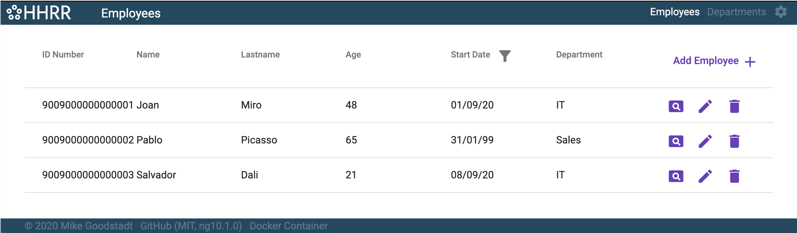

# HHRR-app

## General Description
This is a Front-End demo app for Department-Employee data:


This project was generated with [Angular CLI](https://github.com/angular/angular-cli) version 10.1.0 and uses Angular Material. The project is developed in VSCode and the tasks are managed using the GitHub Projects feature. A Docker-ized version was created with automatic updating directly from the GitHub repository (see below).

The target user environmet is desktop with a modern browser (i.e. not IE11). The app default page is the record Admin for Employees. New/Edit opens a dialog rather than moving to a separate view so as to maintain user task-focus, however for larger forms or tasks, this can be easily passed to a fullscreen view. A basic Settings view is also supplied to manage global settings such as minimum and maximum age limits if required.

### Project Structure
The DataService fetches dummy data from a mock API. An abstract CrudService provides the data via BehaviorSubject Observables. This is extended by DepartmentService and EmployeeService which are injected into a generic AdminComponent view as managed by the AppRoutingModule and the records are presented in tables within the Admin view.

Individual Department and Employee views are avaible by clicking on the view icon in the right-hand Actions column. In the header of this column is a button to add new records. Filtering by date can be performed by clicking the filter icon next to the column header and selecting a date.

The Actions column also provides icon linking to edit and delete dialogs. Data records can be added or modified by the generic EditorComponent using Reactive Forms. (Another example of the editor is included which uses Template-Driven forms.) 

The Department and Emplyee Models extend a common RecordModel as Classes (as opposed to Interfaces) to provides a single source for both for Type definition, checking and defaults. Validation is performed in the form with the relevant error messages shown below the erroneous field.

Ids are managed by an IdService. The specification required Long number for Ids which would require the `bigint` JavaScript type. However as this is [pending universal browser implmentation](https://caniuse.com/bigint), [BigInteger.js](https://github.com/peterolson/BigInteger.js) is used to polyfill and manipulate these Id values.

### Further Development:
- Expanding the DataService to use external API / Firebase would be essential to further testing.
- Adding filtering input to the header of all columns would improve the user experience.
- The components of SharedModule components are mostly 'dumb' (unconnected to the business logic of the main app) such that they could be moved to an Angular Library.
- The Datatable and Editor components can be also converted to 'dumb' to recieved record data `@Input` from the parent Admin view so as to increase separation of concerns.
- If the project requires more extensive use of forms, the use of [ngx-formly](https://formly.dev/) is recommended. This would allow for form creation directly from each record model in line with the DRY approach of the app.
- When Safari 14 is released, the `bigint` type should then be standard across all browsers and the use of BigInteger.js can be reviewed.

## Docker Package
An autoupdated [Docker package is available](https://hub.docker.com/r/mikegoodstadt/hhrr-app):
```
docker pull mikegoodstadt/hhrr-app
docker run -p 3000:80 mikegoodstadt/hhrr-app
```

## Development server

Run `ng serve` for a dev server. Navigate to `http://localhost:4200/`. The app will automatically reload if you change any of the source files.

## Build

Run `ng build` to build the project. The build artifacts will be stored in the `dist/` directory. Use the `--prod` flag for a production build.

## Running unit tests

Run `ng test` to execute the unit tests via [Karma](https://karma-runner.github.io).

## Running end-to-end tests

Run `ng e2e` to execute the end-to-end tests via [Protractor](http://www.protractortest.org/).

## Further help

Please feel free to contact me with any questions or comments: [mikegoodstadt@gmail.com](mailto:mikegoodstadt@gmail.com)